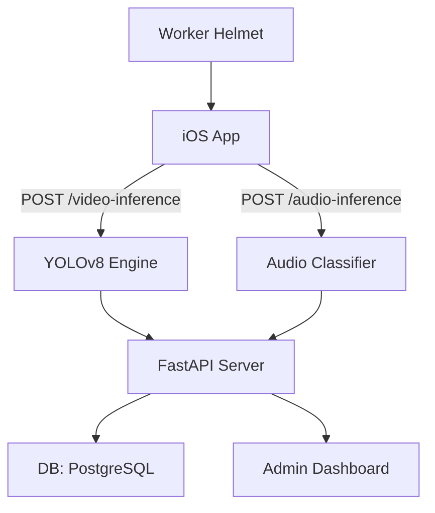

  ## 🧐 모쪼록(Mozzorok): 상업 안전 감지 플랫폼 MVP 구조

### 🎯 프로젝트 개요

- **목표**: 상업 현장에서의 작업자 위험 요소 실시간 감지 및 관리자 알림 시스템 구현
    
- **해결 기술 기능**
    
    - YOLO 기반 위험 행동 감지
        
    - 음성 기반 위험 신향 분석
        
    - 관리자 데시보드 통해 실시간 모니터링
        
    - 사용자 건강정보 및 위험도 기반 분석
        

### 🌐 구현 기술 및 선택 이유

- **Swift(iOS)**의 통화시스템 사용: 가장 간편한 건포적 편성, 여러 SDK 도구와 연동이 만적
    
- **FastAPI**: 가능성이 높고 가방성 좋은 Python 기본 바이트 서버
    
- **WebSocket 분석**
    
    - 기존 시간적 POST 방식은 통신 내용이 폭지되면 컨트롤 없이 실시간 처리가 없어진다
        
    - WebSocket은 한 통신에서 계속적으로 데이터 전송이 가능 → 가능성과 통신 노출 건절 향상
        
- **OPC UA 통신의 확장 가능성 검토**
    
    - 상위 건축을 고려하면서 공사장 건물, 공작 시스템과 연동할 수 있는 모델로 개발
        

---

### 🔧 시스템 역할 및 구조

---

### ✅ 상업안전 체크리스트 도움을 받은 바인 구조

- **참고 문서**: [KOSHA 검사 체크리스트](https://www.kosha.or.kr/)
    
- 사용 참고 항목:
    
    - 보호구 체계 차례 검사
        
    - 고온 / 고소음 현장 가시 경고
        
    - 출입 시간/가입 선거 기본 확인
        

---

### 📊 MVP 것이 가진 가치

- 업체에 대한 단위 매우 높은 감지 시스템
    
- 건강 검사 + 운영 가능성 대비 계층 구조 가능
    
- 새로운 실작자 위험 검사 패드러임 보제
    
- 플랜과 검사 용어로 광고, 방장감지 감지 시스템 가능
    

---

### 💡 회사의 영력을 보여주는 관점에서 보여줄 프리세트

- WebSocket, POST 방식과 연계
    
- 관리자 UI/UX 데이스 통화
    
- OPC UA 연계 확장 가능성
    
- 시스템 디자인과 화면 노출 가능성 및 기술 경리
    

---

### 🚶 가용적인 상업안전 데시보드 UX 구조 값

- 사용자 생년 / 건강 이유 등 검사 사항
    
- 위험도 등규 기준을 기본으로 화면 추가
    
- 관리자 화면에서 여부가 검사 가능
    

---

(가능하면 그래프 또는 프로파일 형식으로 제공해 드림)