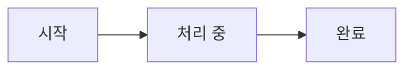

# 🗒️ 일일 로그

- 2025-05-21
- 오늘 한 일:
	- 챗봇 fast api + react로 프로젝트2 발표용으로 개발 환경 분리
	- trOCR의 오메가(Ω) 인식률을 개선 시도 
- 이슈:
	- trOCR의 오메가 인식률 개선 실패
		- Ω 문자 토큰 추가 -> 개선 안됨
		- '옴' 문자 토큰 추가 -> 개선 안됨 
- 2025-05-22
- 오늘 한 일:
	- Backend Entity 작성
	- trOCR의 오메가(Ω) 인식률 개선 시도
		- Omega와 더미 데이터를 함께 학습(train 100+16)(test(20+4))
		- 결과 : 인식은 하지만 결과물이 더 좋지 않은 상태.
- 이슈:
	- Entity 작성과정 중 매핑ID 필요성 학습
	- OneToMany와 ZeroToMany 설정 방법 학습
	- trOCR 학습 결과가 좋지않음

- 2025-05-23
- 오늘 한 일:
	- 발표 자료(코드) 정리해서 공유폴더로 이동
	- Backend repositoty, restcontroller만들고 페이지 구현
	- Backend reduser로 토큰 처리
- 이슈:
	- 현재 구현된 페이지는 암호화 되지않음
	- 발표할 챗봇이 썩 만족할만한 정도는 아님(유사성 높은 질문으로 학습한 결과)

- 2025-05-26
- 오늘 한 일:
	- 챗봇 업그레이드(책 정보를 통해 정보 검색)
	- 발표 자료 정리
- 이슈:
	- 챗봇 답변 오염 가능성
	- 발표자료에 모델 평가 및 시연 영상 필요

- 2025-05-29
- 오늘 한 일:
	- 산업재해 스마트 안전모 구상
	- 옵시디언 머메이드 작성법 학습
- 이슈:
	- 챗봇 답변 오염 가능성
	- 발표자료에 모델 평가 및 시연 영상 필요

