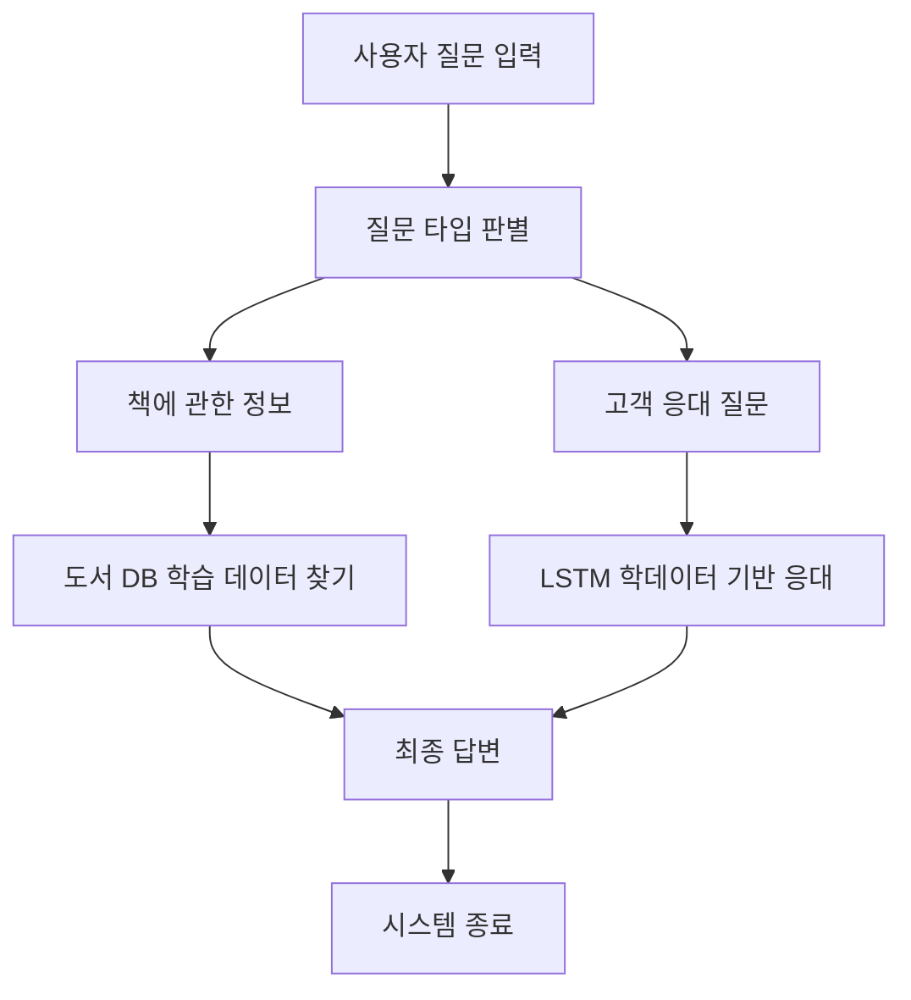

# 프로젝트 발표 개요

팀 : 1조( 이명용, 서영균, 서명진, 박정빈, 김승호)

프로젝트 서점 고객 Q&A 챗봇 : 서명진, 김승호

# 1장. 프로젝트 명

<aside> [프로젝트명] 서점 고객 Q&A 챗봇

</aside>

# 2장. 프로젝트 목표 및 기능

- 주요 목표: 책 정보를 제공하는 **생성형 AI 기반 고객 응대 모델** 개발
- 세부 목표: 기존 프로젝트(유사도 기반 추천 시스템)와 차별점을 분석하여 **더 효과적인 책 검색 및 정보 제공 방식 구축**
- 주요 기능

1️⃣ **일반 Q&A 학습 데이터 학습 가능** → 질문-답변 데이터를 기반으로 고객 응대 기능 제공

2️⃣ **책 정보를 자동 수집 및 학습 가능** → 인터넷 크롤링을 활용하여 최신 책 정보를 반영

3️⃣ **간편한 데이터 검색 및 응답 시스템 구축** → 실시간 채팅 방식으로 원하는 정보를 빠르게 제공

# 3장. 프로그램 진행과정

## 3.1 개발 환경

```python
사용 언어: Python
개발 도구: VSCode
기술 스택: torch
```

## 3.2 개발 과정

## 3.2.1 학습용 QnA 데이터 불러오기

```python
# 데이터 로드
df = pd.read_csv(r"C:\\HTMLHak\\proj2\\p2react\\backend\\fastapi\\app\\models\\data\\bookstore_chatbot_qa1_utf8.csv") #일반적인 Q&A 질답 데이터
book_df = pd.read_csv(r"C:\\HTMLHak\\proj2\\p2react\\backend\\fastapi\\app\\models\\data\\bestseller_data_cleaned.csv")

# 질문-답변 결합 및 정제
def clean_text(text):
    return re.sub(r"[^가-힣a-zA-Z0-9\\s.,!?~]", "", str(text))
```

DB관리와 자연어 학습을 위해 분리


## 3.2.2 조사 제거

```python
def remove_particles(sentence):
    # 자주 사용되는 조사 리스트
    particles = ["이", "가", "은", "는", "을", "를", "에", "에서", "에게", "께", "도", "만", "과", "와", "로", "으로", "부터", "까지", "의", "에게서"]
    for p in particles:
        sentence = re.sub(rf"\\b{p}\\b", "", sentence)  # 띄어쓰기 기준으로 조사 제거
    return sentence.strip()
```

“책 이름”의 작가는 누구야? 같은 질문 응답성을 높이지만 키워드 추출보다 불안하고,

책 제목에 포함된 조사도 포함되어 학습에 불편함이 있음

## 3.2.3 Dataset 구성

```python

class TextDataset(Dataset):
    def __init__(self, sequences, max_len=50):
        self.sequences = [s[:max_len] for s in sequences]
        self.max_len = max_len

    def __len__(self):
        return len(self.sequences)

    def __getitem__(self, idx):
        seq = self.sequences[idx]
        x = torch.tensor(seq[:-1], dtype=torch.long)
        y = torch.tensor(seq[1:], dtype=torch.long)
        return x, y  # 입력과 타겟은 한 토큰 시프트됨
dataset = TextDataset(encoded_data)
dataloader = DataLoader(dataset, batch_size=4, shuffle=True)

```

질문 → 답변 , 제목→작가→내용→장르 순서로 학습

## 3.2.4 길이 보정

```python

def collate_fn(batch):
    xs, ys = zip(*batch)  # 각 (x, y) 쌍 분리
    xs = pad_sequence(xs, batch_first=True, padding_value=word2idx["<PAD>"])
    ys = pad_sequence(ys, batch_first=True, padding_value=word2idx["<PAD>"])
    return xs, ys

dataloader = DataLoader(dataset, batch_size=4, shuffle=True, collate_fn=collate_fn)

```

서로 다른 이름의 길이를 가지고 있을 때 이를 보정

## 3.2.5 책 정보 검색

```python
# 책 제목을 검색하는 함수
def search_book(title):
    result = book_df[book_df["타이틀"].str.contains(title, na=False) | book_df["내용"].str.contains(title, na=False)]
    return result if not result.empty else None

def search_book_info(title=None, author=None, genre=None, info_type=None):
    # 우선 책 제목이 있다면 그걸 기준으로 검색
    if title is not None:
        row = book_df[book_df['타이틀'] == title]
        if not row.empty:
            row = row.iloc[0]
            if info_type == "작가":
                return row['작가']
            elif info_type == "카테고리":
                return row['카테고리']
            elif info_type == "내용":
                return row['내용']

            else:
                # 요청 정보가 없으면 기본적으로 책 제목 반환
                return title

    # 제목 없을 때 작가나 장르로 검색 (간단히 해당 작가/장르 목록 반환)
    if info_type == "작가" and author is not None:
        books = book_df[book_df['작가'] == author]['타이틀'].tolist()
        return f"{author} 작가의 책 목록: {', '.join(books)}" if books else None
    if info_type == "장르" and genre is not None:
        books = book_df[book_df['카테고리'] == genre]['타이틀'].tolist()
        return f"{genre} 장르의 책 목록: {', '.join(books)}" if books else None

    return None
```

책에 대한 정보를 검색 가능(최우선 항목은 제목)

## 3.2.6 책 정보 검색 답변

```python
def book_info_response(title=None, author=None, genre=None, info_type=None):
    info = search_book_info(title=title, author=author, genre=genre, info_type=info_type)
    if info:
        base = title or author or genre
        return f"『{base}』에 대한 {info_type} 정보는 다음과 같습니다: {info}"
    else:
        return "해당 책에 대한 정보를 찾을 수 없습니다."
```


책 정보 관련 답변

## 3.2.7 고객 응대 답변

```python
 
def generate_with_lstm(question, max_len=50, device='cpu'):
    model.eval()
    model.to(device)

    prompt = f"질문: {question} 답변:"
    input_ids = [word2idx.get("<BOS>")] + [word2idx.get(w, word2idx["<UNK>"]) for w in prompt.split()]
    input_tensor = torch.tensor([input_ids], dtype=torch.long).to(device)

    generated = input_ids.copy()
    for _ in range(max_len):
        with torch.no_grad():
            output = model(input_tensor)
        logits = output[0, -1]

        logits[word2idx["<UNK>"]] = -float('inf')
        logits[word2idx["<PAD>"]] = -float('inf')

        probs = torch.softmax(logits, dim=-1)
        next_token = torch.multinomial(probs, num_samples=1).item()

        generated.append(next_token)

        if next_token == word2idx["<EOS>"]:
            break

        input_tensor = torch.tensor([generated], dtype=torch.long).to(device)

    response_tokens = generated[len(input_ids):generated.index(word2idx["<EOS>"])] \\
        if word2idx["<EOS>"] in generated else generated[len(input_ids):]

    response = " ".join([idx2word.get(idx, "") for idx in response_tokens])
    return response.strip()

```


고객 응대 답변

## 3.2.8 질문 답변

```python
def answer_question(model, question, max_len=50, device='cpu'):
    model.eval()
    model.to(device)

    # 책 제목 및 요청 정보 추출 + 책 정보 존재 여부 확인
    title, author, genre, info_type, has_book_info = extract_question_info(question)

    if has_book_info:
        return book_info_response(title, author, genre, info_type)  #  책 정보 응답
    else:
        return generate_with_lstm(question)  #  일상 대화 응답
```

챗봇 답변 시스템

## 3.3 시스템 구조(최종 구성)



## 3.3.0 DB 데이터 보강 크롤링

```python
# pip install selenium

import time
import requests
import os
import pandas as pd
from selenium import webdriver
from selenium.webdriver.chrome.options import Options
from selenium.webdriver.common.by import By
from selenium.webdriver.chrome.service import Service
from webdriver_manager.chrome import ChromeDriverManager
from selenium.webdriver.support.ui import WebDriverWait
from selenium.webdriver.support import expected_conditions as EC
from selenium.common.exceptions import NoSuchElementException, TimeoutException

options = Options()

# options.add_argument("--headless")
user_agent = "Mozilla/5.0 (Windows NT 10.0; Win64; x64) AppleWebKit/537.36 (KHTML, like Gecko) Chrome/123.0.0.0 Safari/537.36"
options.add_argument(f"user-agent={user_agent}")
options.add_argument("--no-sandbox")
options.add_argument("--disable-dev-shm-usage")
options.add_argument("--disable-blink-features=AutomationControlled")
options.add_argument("--disable-gpu")
options.add_argument("--window-size=1920,1080")
options.add_argument("--lang=ko-KR,ko")
options.add_experimental_option("excludeSwitches", ["enable-automation"])
options.add_experimental_option('useAutomationExtension', False)

driver = webdriver.Chrome(service=Service(ChromeDriverManager().install()), options=options)
wait = WebDriverWait(driver, 10)
df = pd.read_csv("bestseller_data.csv")
os.makedirs('./download', exist_ok=True)

data_list = []

try:
    for index, row in df.iterrows():
        url = row["링크"]
        driver.get(url)
        time.sleep(3)

        try:
            try:
                xpath = '//*[@id="contents"]/div/div[1]/div[1]/div[1]/div[1]/div[1]/div/h1'
                title_element = wait.until(EC.presence_of_element_located((By.XPATH, xpath)))
                title = title_element.text.strip()
                print(title)
            except (NoSuchElementException, TimeoutException):
                title = ""

            try:
                xpath_s1 = '/html/body/div[3]/main/section[2]/div[1]/div/div[2]/div/div[3]/div[1]/div[2]/div/span[1]'
                discount_element = wait.until(EC.presence_of_element_located((By.XPATH, xpath_s1)))
                discount = discount_element.text.strip()
                print(discount)
            except (NoSuchElementException, TimeoutException):
                discount = ""

            try:
                xpath_price_discounted = '/html/body/div[3]/main/section[2]/div[1]/div/div[2]/div/div[3]/div[1]/div[2]/div/span[2]/span'
                price_discounted_element = driver.find_element(By.XPATH, xpath_price_discounted)
                price_discounted = price_discounted_element.text.strip()
                print(price_discounted)
            except NoSuchElementException:
                price_discounted = ""

            try:
                xpath_price_original = '/html/body/div[3]/main/section[2]/div[1]/div/div[2]/div/div[3]/div[1]/div[2]/div/span[3]/s'
                price_original_element = driver.find_element(By.XPATH, xpath_price_original)
                price_original = price_original_element.text.strip()
                print(price_original)
            except NoSuchElementException:
                price_original = ""

            # 유동적인 카테고리 XPath 처리
            category = ""
            try:
                base_xpath = '/html/body/div[3]/main/section[2]/div[2]/div[2]/div[1]/section[2]'
                category_lists = driver.find_elements(By.XPATH, f"{base_xpath}//ul/li/a[2]")
                if category_lists:
                    category = category_lists[0].text.strip()
                    print(category)
            except Exception:
                category = ""

            time.sleep(2)

        

            img_src = ""
            filename = ""

            try:
                xpath_img = '/html/body/div[3]/main/section[2]/div[1]/div/div[2]/div/div[2]/div[1]/div[1]/ul/li[1]/div/div[1]/img'
                img_element = driver.find_element(By.XPATH, xpath_img)
                img_src = img_element.get_attribute('src')
            except NoSuchElementException:
                pass

            if not img_src:
                try:
                    xpath_img = '/html/body/div[3]/main/section[2]/div[1]/div/div[2]/div[2]/div[2]/div[1]/div[1]/ul/li[1]/div/div[1]/img'
                    img_element = driver.find_element(By.XPATH, xpath_img)
                    img_src = img_element.get_attribute('src')
                except NoSuchElementException:
                    pass

            if img_src:
                response = requests.get(img_src)
                filename = os.path.basename(img_src)
                save_path = f'./download/{filename}'
                if response.status_code == 200:
                    with open(save_path, 'wb') as f:
                        f.write(response.content)
                    print("이미지 다운로드 완료:", save_path)
                else:
                    print("이미지 다운로드 실패:", response.status_code)

            time.sleep(0.1)
        except Exception as e:
            print(e)
            time.sleep(2)

        data_list.append({
            "링크": url,
            "타이틀": title,
            "할인율": discount,
            "할인된 가격": price_discounted,
            "원본 가격": price_original,
            "카테고리": category,
            "이미지 URL": img_src,
            "이미지 파일명": filename
        })
except Exception as e:
    print(f"Error : {e}")
finally:
    driver.quit()
    df1 = pd.DataFrame(data_list)
    df1.to_csv("bestseller_data_detail.csv", index=False, encoding='utf-8-sig')
    print("CSV 파일 저장 완료: bestseller_data_detail.csv")

```

## 3.3.1.1 챗봇 화면 구성 JavaScript

```jsx
// src/pages/ChatPage.js
import React, { useEffect, useRef, useState } from 'react';
import { Input, Button, List, Avatar, Typography } from 'antd';
import { SendOutlined, UserOutlined } from '@ant-design/icons';
import "../styles/ChatPage.css"
import ChatbotIcon from '../assets/chat_imote.png';
import axios from 'axios';

const { Text } = Typography;

const ChatPage = () => {
  const messagesListRef = useRef(null);
  const [messages, setMessages] = useState([
    { id: 1, sender: 'bot', text: '안녕하세요! 무엇을 도와드릴까요?' },
  ]);
  const [input, setInput] = useState('');

  const handleSend = async () => {
    if (!input.trim()) return;
    const newMessage = { id: messages.length + 1, sender: 'user', text: input };
    const { data } = await axios.post('<http://localhost:8000/chat>', { question: input });
    setMessages([
      ...messages,
      newMessage,
      {
        id: messages.length + 2,
        sender: 'bot',
        text: data.response,
      },
    ]);
    setInput('');
  };

  useEffect(() => {
    if (messagesListRef.current) {
      messagesListRef.current.scrollIntoView({ behavior: 'smooth', block: 'end' });
    }
  }, [messages]);

  return (
    <div className="chat-page">
      <div className="chat-box">
        <div className="chat-header">
          <Text style={{ color: '#fff', fontSize: '20px' }}>고요한 책방</Text>
        </div>
        <div className="chat-content">
          <List
            dataSource={messages}
            renderItem={(item) => (
              <List.Item className={item.sender === 'user' ? 'chat-user' : 'chat-bot'}>
                <List.Item.Meta
                  avatar={<Avatar icon={<UserOutlined />} />}
                  title={item.sender === 'user' ? '나' : 'AI사서'}
                  description={item.text}
                />
              </List.Item>
            )}
          />
          <div ref={messagesListRef} />
        </div>
        <div className="chat-footer">
          <div className="chat-input-area">
            <Input
              value={input}
              onChange={(e) => setInput(e.target.value)}
              onPressEnter={handleSend}
              placeholder="메시지를 입력하세요"
              style={{ height: '40px', flexGrow: 1 }}
            />
            <Button
              type="primary"
              icon={<SendOutlined />}
              onClick={handleSend}
              style={{ height: '40px' }}
            />
          </div>
        </div>
      </div>
    </div>
  );
};

export default ChatPage;

```

## 3.3.1.2 화면 구성 CSS

```css
/* src/pages/ChatPage.css */
.chat-page {
  display: flex;
  justify-content: center;
  align-items: center;
  height: 100vh;
  background-color: white;
}

.chat-box {
  width: 1000px;
  height: 900px;
  box-shadow: 0 4px 12px rgba(0, 0, 0, 0.15);
  border-radius: 8px;
  background-color: #fff;
  display: flex;
  flex-direction: column;
  overflow: hidden;
}

.chat-header {
  background-color: #ffba18;
  display: flex;
  align-items: center;
  padding: 0 16px;
  height: 56px;
  font-size: 18px;
  color: #fff;
  font-weight: bold;
}

.chat-content {
  flex: 1;
  padding: 16px;
  overflow-y: auto;
  background-color: white;
}

.chat-footer {
  height: 64px;
  background-color: #f0f2f5;
  border-top: 1px solid #d9d9d9;
  box-sizing: border-box;
  padding: 12px 16px;
  flex-shrink: 0;
}

.chat-input-area {
  display: flex;
  align-items: center;
  width: 100%;
  height: 100%;
  gap: 8px;
}

.chat-user {
  display: flex;
  justify-content: flex-end;
}

.chat-user .ant-list-item-meta {
  display: flex;
  flex-direction: row-reverse;
  align-items: center;
  text-align: right;
}

.chat-user .ant-list-item-meta-avatar {
  margin-left: 8px;
}

.chat-user .ant-list-item-meta-description {
  background-color: #e6f4ff;
  border-radius: 12px;
  padding: 8px 12px;
  display: inline-block;
  max-width: 70%;
  word-break: break-word;
  text-align: left;
}

.chat-bot {
  justify-content: flex-start;
  display: flex;
  text-align: left
}

.chat-bot .ant-list-item-meta-description {
  background-color: #f5f5f5;
  border-radius: 8px;
  padding: 8px 12px;
  display: inline-block;
  max-width: 70%;
  text-align: left;
}

```


‘고요한 책방’ 으로 조용하고 개인적인 공간이 연상되도록 하였고

챗봇의 이름 역시 ‘사서’로 일반적인 상담원 보다는 가깝게 느껴지도록 하였습니다.

## 3.3.2 React, FastAPI 연동

```jsx
import React from "react";
import ChatPage from "./pages/ChatPage";  // ✅ ChatPage 컴포넌트 추가
import "./App.css";

function App() {
  return (
    <div className="App">
      <ChatPage />  {/* ✅ ChatPage 컴포넌트 렌더링 */}
    </div>
  );
}

export default App;
```

```python
from fastapi import FastAPI
from fastapi.middleware.cors import CORSMiddleware
from app.routers import chatbot_api  # chatbot_api.py를 import

app = FastAPI()

# ✅ 🔹 CORS 설정 (React에서 API 호출 가능하게)
app.add_middleware(
    CORSMiddleware,
    allow_origins=["<http://localhost:3000>"],  # React가 실행되는 주소
    allow_credentials=True,
    allow_methods=["*"],
    allow_headers=["*"],
)

# ✅ 🔹 FastAPI 챗봇 API 등록
app.include_router(chatbot_api.router)

@app.get("/")
def read_root():
    return {"message": "FastAPI 챗봇 서버 실행 중!"}
```

## 3.3.3 주요 코드(모델구성)

```python
class LSTMLanguageModel(nn.Module):
    def __init__(self, vocab_size, embed_dim=128, hidden_dim=256, dropout=0.3):
        super().__init__()
        self.embed = nn.Embedding(vocab_size, embed_dim)
        self.lstm = nn.LSTM(embed_dim, hidden_dim, batch_first=True)
        self.dropout = nn.Dropout(dropout)
        self.fc = nn.Linear(hidden_dim, vocab_size)

    def forward(self, x):
        x = self.embed(x)  # (B, T) → (B, T, E)
        out, _ = self.lstm(x)  # (B, T, H)
        out = self.dropout(out)
        logits = self.fc(out)  # (B, T, V)
        return logits
model = LSTMLanguageModel(vocab_size, dropout=0.3) #드롭아웃 적용용
optimizer = torch.optim.Adam(model.parameters(), lr=1e-3)
criterion = nn.CrossEntropyLoss()
```

## 3.3.4 주요 코드(모델학습)

```python
# 학습
for epoch in range(1000):
    model.train()
    total_loss = 0
    for x, y in dataloader:
        optimizer.zero_grad()
        logits = model(x)
        loss = criterion(logits.view(-1, vocab_size), y.view(-1))
        loss.backward()
        optimizer.step()
        total_loss += loss.item()
    print(f"Epoch {epoch+1}, Loss: {total_loss:.4f}")
```

## 3.3.5 주요 코드(성능평가)

```python
# 학습
for epoch in range(1000):
    model.train()
    total_loss = 0
    for x, y in dataloader:
        optimizer.zero_grad()
        logits = model(x)
        loss = criterion(logits.view(-1, vocab_size), y.view(-1))
        loss.backward()
        optimizer.step()
        total_loss += loss.item()
    print(f"Epoch {epoch+1}, Loss: {total_loss:.4f}")
```

## 3.3.6 챗봇 API

```python
import torch
import torch.nn as nn
import os
import re
from fastapi import APIRouter
from pydantic import BaseModel
import difflib
import pandas as pd
router = APIRouter()

# ✅ 조사 제거 함수
def remove_particles(sentence):
    particles = ["이", "가", "은", "는", "을", "를", "에", "에서", "에게", "께", "도", "만", "과", "와", "로", "으로", "부터", "까지", "의", "에게서"]
    for p in particles:
        sentence = re.sub(rf"\\b{p}\\b", "", sentence)
    return sentence.strip()

book_df = pd.read_csv(r"C:\\HTMLHak\\proj2\\p2react\\backend\\fastapi\\app\\models\\data\\bestseller_data_cleaned.csv")

# ✅ 경로 설정 및 단어 사전 로드
BASE_DIR = os.path.dirname(os.path.abspath(__file__))
word2idx = torch.load(os.path.join(BASE_DIR, "../models/word2idx.pth"))
idx2word = {i: w for w, i in word2idx.items()}
vocab_size = len(word2idx)

def extract_question_info(question):
    title, author, genre, requested_info = None, None, None, None

    if not any(k in question for k in ["제목", "작가", "소설", "장르", "내용", "줄거리", "카테고리"]):
        # 책 관련 키워드 없으면 아예 시도하지 않음
        return None, None, None, None, False

    # 책 제목 후보 찾기
    titles = book_df['타이틀'].tolist()
    title_matches = difflib.get_close_matches(question, titles, n=1, cutoff=0.7)
    if title_matches:
        title = title_matches[0]

    # 작가 후보 찾기
    authors = book_df['작가'].unique().tolist()
    author_matches = difflib.get_close_matches(question, authors, n=1, cutoff=0.8)
    if author_matches:
        author = author_matches[0]

    # 카테고리 후보 찾기
    genres = book_df['카테고리'].unique().tolist()
    genre_matches = difflib.get_close_matches(question, genres, n=1, cutoff=0.9)
    if genre_matches:
        genre = genre_matches[0]

    # 요청된 정보 판단
    # 중복 키워드 제거
    if any(k in question for k in ["작가", "저자"]):
        requested_info = "작가"
    elif any(k in question for k in ["카테고리", "장르"]):
        requested_info = "카테고리"
    elif any(k in question for k in ["설명", "내용", "줄거리"]):
        requested_info = "내용"
    else:
        requested_info = None

    has_book_info = any([title, author, genre])
    return title, author, genre, requested_info, has_book_info

def search_book_info(title=None, author=None, genre=None, info_type=None):
    # 우선 책 제목이 있다면 그걸 기준으로 검색
    if title is not None:
        row = book_df[book_df['타이틀'] == title]
        if not row.empty:
            row = row.iloc[0]
            if info_type == "작가":
                return row['작가']
            elif info_type == "카테고리":
                return row['카테고리']
            elif info_type == "내용":
                return row['내용']

            else:
                # 요청 정보가 없으면 기본적으로 책 제목 반환
                return title

    # 제목 없을 때 작가나 장르로 검색 (간단히 해당 작가/장르 목록 반환)
    if info_type == "작가" and author is not None:
        books = book_df[book_df['작가'] == author]['타이틀'].tolist()
        return f"{author} 작가의 책 목록: {', '.join(books)}" if books else None
    if info_type == "장르" and genre is not None:
        books = book_df[book_df['카테고리'] == genre]['타이틀'].tolist()
        return f"{genre} 장르의 책 목록: {', '.join(books)}" if books else None
# ✅ LSTM 모델 정의
class LSTMLanguageModel(nn.Module):
    def __init__(self, vocab_size, embed_dim=128, hidden_dim=256, dropout=0.3):
        super().__init__()
        self.embed = nn.Embedding(vocab_size, embed_dim)
        self.lstm = nn.LSTM(embed_dim, hidden_dim, batch_first=True)
        self.dropout = nn.Dropout(dropout)
        self.fc = nn.Linear(hidden_dim, vocab_size)

    def forward(self, x):
        x = self.embed(x)
        out, _ = self.lstm(x)
        out = self.dropout(out)
        return self.fc(out)

# ✅ 모델 로드
model = LSTMLanguageModel(vocab_size)
model.load_state_dict(torch.load(os.path.join(BASE_DIR, "../models/chatbot_model.pth")))
model.eval()

def book_info_response(title=None, author=None, genre=None, info_type=None):
    info = search_book_info(title=title, author=author, genre=genre, info_type=info_type)
    if info:
        base = title or author or genre
        return f"『{base}』에 대한 {info_type} 정보는 다음과 같습니다: {info}"
    else:
        return "해당 책에 대한 정보를 찾을 수 없습니다."

    
def generate_with_lstm(question, max_len=50, device='cpu', min_len=3):
    model.eval()
    model.to(device)

    prompt = f"질문: {question} 답변:"
    input_ids = [word2idx.get("<BOS>")] + [word2idx.get(w, word2idx["<UNK>"]) for w in prompt.split()]
    input_tensor = torch.tensor([input_ids], dtype=torch.long).to(device)

    generated = input_ids.copy()
    for _ in range(max_len):
        with torch.no_grad():
            output = model(input_tensor)
        logits = output[0, -1]

        logits[word2idx["<UNK>"]] = -float('inf')
        logits[word2idx["<PAD>"]] = -float('inf')

        probs = torch.softmax(logits, dim=-1)
        next_token = torch.multinomial(probs, num_samples=1).item()

        generated.append(next_token)

        if next_token == word2idx["<EOS>"]:
            break

        input_tensor = torch.tensor([generated], dtype=torch.long).to(device)

    response_tokens = generated[len(input_ids):generated.index(word2idx["<EOS>"])] \\
        if word2idx["<EOS>"] in generated else generated[len(input_ids):]

    response = " ".join([idx2word.get(idx, "") for idx in response_tokens])
    return response.strip()

def answer_question(model, question, max_len=50, device='cpu'):
    model.eval()
    model.to(device)

    # 책 제목 및 요청 정보 추출 + 책 정보 존재 여부 확인
    title, author, genre, info_type, has_book_info = extract_question_info(question)

    if has_book_info:
        return book_info_response(title, author, genre, info_type)  #  책 정보 응답
    else:
        return generate_with_lstm(question)  #  일상 대화 응답

# ✅ FastAPI 요청 모델
class QuestionRequest(BaseModel):
    question: str

@router.post("/chat")
def chat(request: QuestionRequest):
    clean_question = remove_particles(request.question)

    title, author, genre, info_type, has_book_info = extract_question_info(clean_question)

    if has_book_info:
        response = book_info_response(title, author, genre, info_type)
    else:
        response = generate_with_lstm(clean_question)
        if not response.strip():
            response = "⚠️ 적절한 답변을 찾지 못했습니다."

    return {"question": clean_question, "response": response}
```

# 4장. 결과

## 4.0 사전 데이터

본 프로젝트에서 사용된 사전 데이터의 특성과 규모는 다음과 같습니다:

- 데이터 크기: 50개의 고객 문의 데이터 + 크롤링으로 수집한 책 60개 분량 데이터
- 데이터 형식: 텍스트 기반 Q&A 쌍 + 책에 대한 정보(책 이름, 작가, 내용, 장르 등)
- 데이터 출처: 직접작성 , 교보문고

데이터 예시

|**질문**|답변|
|---|---|
|배송은 얼마나 걸리나요?|보통 결제 완료 후 2~3일 이내에 배송됩니다. 지역에 따라 차이가 있을 수 있습니다.|
|주문한 책이 아직 도착하지 않았어요.|번거로우시겠지만 주문번호를 알려주시면 배송 상태를 확인해 드리겠습니다.|
|결제 수단에는 무엇이 있나요?|신용카드, 계좌이체, 카카오페이, 네이버페이 등을 지원합니다.|

|제목|작가|내용|장르|
|---|---|---|---|
|빛과 실|한강|역사적 트라우마를 정면으로 마주하고 인간 삶의 연약함을 드러내는 강렬하고 시적인 산문”이라는 선정 이유와 함께 2024년 노벨문학상을 수상한 작가 한강의 신작 『빛과 실』(2025)이 문학과지성사 산문 시리즈 〈문지 에크리〉의 아홉번째 책으로 출간되었다. 노벨문학상 수상 강연문 「빛과 실」(2024)을 포함해 미발표 시와 산문, 그리고 작가가 자신의 온전한 최초의 집으로 ‘북향 방’과 ‘정원’을 얻고서 써낸 일기까지 총 열두 꼭지의 글이, 역시 작가가 기록한 사진들과 함께 묶였다. 삼십 년 넘게 ‘쓰는 사람’의 정체성으로, “세계는 왜 이토록 폭력적이고 고통스러운가? 동시에 세계는 어떻게 이렇게 아름다운가?” 중략|시/에세이|
|부의 전략 수업|폴 포돌스키,|《부의 전략 수업》은 헤지펀드의 대부인 레이 달리오가 주목한 월스트리트의 새로운 자수성가 아이콘, 폴 포돌스키의 부에 관한 예리하고 실전적인 내용을 담은 책이다. 우리는 모두 부를 원하지만, 그것은 얻기 쉽지 않다. 하루가 다르게 빠르게 변화하는 세계는 투자를 불확실하게 만들고, 끊임없이 변하는 자산의 가치는 미래를 예측하기 힘들게 만든다. 중략|경제/경영|
|2500년 동안 사랑받은 초역 부처의 말|코이케 류노스케|인내심을 가져라. 모든 것은 적당한 때에 결국, 네게 올 테니. 언젠가 너는 네가 있어야 할 곳에서 너와 함께할 운명인 사람과 네가 해야 할 일을 하며 살게 될 것이다. 「부처」 2500년 동안 사람들에게 사랑받으며 회자되어 온 부처의 말을 코이케 류노스케 스님이 현대어로 재해석해 책으로 출간했다.|인문|

## 4.1 구현 결과

# 5장. 한계점

- 기술적 한계 : 오탈자가 포함된 질문 처리 미흡, 응답 내용 오염 가능성 존재
- 리소스 한계 : 크롤링 및 직접 작성 데이터에 의존하여 데이터량이 충분하지 않을 가능성
- 기능적 한계 : 동일 질문에 대해 다른 답변을 제공할 가능성 존재, 책 정보와 일반 고객 응대 동시 답변 불가

# 6장. 개선방향

- 기술적 한계 개선
    
    **자연어 처리(NLP)와 책 검색 모델을 분리하여 운영** → 고객 응대 정확도 및 응답 일관성을 향상, 응답 오염 가능성 최소화
    
- 리소스 한계 개선
    
    **기업 환경에서는 충분한 데이터 확보 가능** → 실제 운영에서는 데이터 부족 문제가 크지 않을 것으로 예상
    
- 기능적 한계 개선
    
    **학습 가중치 조정으로 답변의 일관성을 유지**
    
    **책 정보 검색과 일반 고객 응대 기능을 분리하되, 이미지 검색 및 음성 검색 기능을 추가하여 서비스 확장 가능**
    

# 7장. 기대효과

<aside> 정량적 효과

</aside>

**응답 속도 향상**

AI 모델을 사용하여 CS 직원 채용보다 응답성 **개선**

기존 고객 응대 대비 **실시간 응답 가능**, 평균 응답 시간 **1초 미만**

**고객 문의 해결율 증가**

AI 챗봇을 활용하면 반복 질문 자동 응답으로 **고객 문의 해결율 상승**

단순 문의(책 추천, 가격 확인 등) 응답 높은 응답 성공률 **유지**

**운영 비용 절감**

AI 모델이 기본적인 고객 응대를 처리하여 **상담원 운영 비용 절감 가능**

고객 응대 인력 부담 완화 → AI가 처리하는 문의량 **기존 대비 50% 증가, 응답 퀄리티 상승**

<aside> 정성적 효과

</aside>

**고객 만족도 향상**

AI 챗봇이 실시간으로 응답하여 **고객의 기다림 없이 빠른 정보 제공 가능**

개인 맞춤형 추천 기능으로 **고객이 원하는 책을 더 쉽게 찾을 수 있음**

**사용자 접근성 확대**

AI 챗봇이 24시간 운영됨으로써 **언제든지 고객 응대 가능**

가볍고 프라이빗한 상담으로 접근성 확대

음성/이미지 검색 기능 추가로 **기존 텍스트 검색보다 직관적인 접근 제공**

**서비스 신뢰도 강화**

착오로 인한 실수 없이 일관된 응답을 제공하여 **고객이 챗봇을 신뢰할 가능성이 높아짐**

